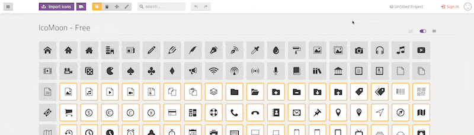
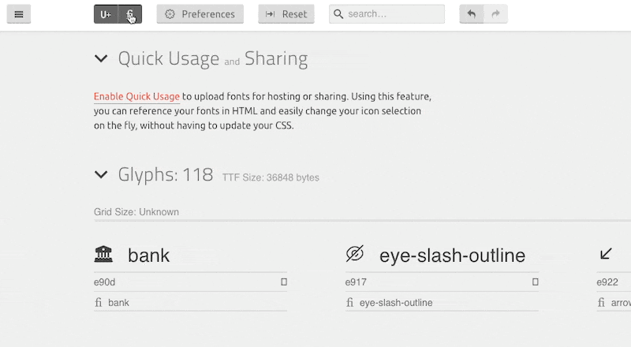

# alpha-icons

### maintainer: Jose (jose@alphalitical.com)

## changelogs

v1.1 (June 10, 2022):
- added edit and edit-outline icons
- update README

v1.0.1 (June 10, 2022):
- update README

v1.0 (June 9, 2022):
- initial commit

## note for future maintainer:

to update the icon font, follow this steps:
1. clone this repo to your local machine
2. go to [Icomoon App](https://icomoon.io)
3. you don't need to login because the font generator happens on your browser's local cache. although if we have enough budget, create an account and buy the paid plans for webhost the icon-font
4. Click Icomoon App
5. Click the project icon 
6. Click Import Project
7. Select selection.js file from repository you cloned at the first step.
8. Load the project you just imported.
9. Click import icons and select the svg icons you want to add (please make sure that all single-stroke has been converted into outline stroke)
10. Check if your icons has been imported correctly.
11. Click generate font
12. Show ligatures to set the ligature for each icon 
13. Set the ligatures for each icon, one icon can have more than one ligature. protip: try to use a more general ligature, not context specific ones. example: use question-circle instead of help
14. If all the icons are set, you can set the version number for this release. (optional)
15. Download the font.
16. Extract the zip.
17. Replace the old font in alpha-icons/fonts/ with the new font
18. Replace the old files (liga.js, selection.json, style.css) with the new updated files
19. Add the additional icon svgs into the alpha-icons/svg/display folder
20. Update the changelogs in README.md
21. Push the update to the repo.